# Architecture Documentation

## Overview

NirvanaRemap is built using **Clean Architecture** (Onion Architecture) principles, separating concerns into distinct layers with clear dependency rules. The UI layer uses the **MVVM** (Model-View-ViewModel) pattern for separation of presentation logic.

## Purpose

The system enables **gamepad input remapping** by:
1. Capturing raw physical inputs from gamepads/joysticks
2. Applying user-defined mappings to transform inputs
3. Emitting transformed inputs as a virtual Xbox 360 controller

This allows players to use non-standard controllers with games expecting standard Xbox layouts, customize controls beyond game settings, or address accessibility needs.

---

## Architectural Layers

```mermaid
graph TB
    subgraph Presentation["🖥️ Presentation Layer (Avalonia)"]
        UI[Views & ViewModels<br/>MVVM Pattern]
        Services[UI Services<br/>GamepadRemapService<br/>RawVirtualizationRunner]
    end
    
    subgraph Application["⚙️ Application Layer"]
        Orchestrator[GamepadVirtualization<br/>Orchestrator]
    end
    
    subgraph Domain["🎯 Domain Layer (Core)"]
        Interfaces[Interfaces<br/>IGamepadService<br/>IOutputService<br/>IHidHideService]
        Entities[Entities<br/>GamepadState<br/>CalibrationSettings]
    end
    
    subgraph Infrastructure["🔌 Infrastructure Layer"]
        ViGEm[ViGEm Output<br/>Virtual Controller]
        HidHide[HidHide CLI<br/>Device Hiding]
        SDL[SDL3 Input<br/>Physical Capture]
    end
    
    UI --> Services
    Services --> Orchestrator
    Services --> Interfaces
    Orchestrator --> Interfaces
    Interfaces -.implements.- ViGEm
    Interfaces -.implements.- HidHide
    Interfaces -.implements.- SDL
```



### Layer Responsibilities

| Layer | Purpose | Dependencies | Key Files |
|:------|:--------|:------------|:----------|
| **Presentation** | User interface and view logic | Core, ApplicationLayer, Infrastructure | `Program.cs`, `MainViewModel.cs`, `GamepadRemapService.cs` |
| **Application** | Business rules orchestration | Core | `GamepadVirtualizationOrchestrator.cs` |
| **Domain (Core)** | Business entities and contracts | None (pure domain) | `IGamepadService.cs`, `GamepadState.cs`, `IHidHideService.cs` |
| **Infrastructure** | External system adapters | Core | `ViGEmOutput.cs`, `HidHideCliService.cs`, XInput/SDL adapters |

---

## Execution Flow

### Main Application Flow (GUI Mode)


### Headless Mode Flow (--raw argument)


### Input Capture to Output Flow

```mermaid
graph LR
    Physical[Physical Controller] -->|SDL3| Capture[GamepadRemapService]
    Capture -->|Snapshot<br/>name→value| Engine[MappingEngine]
    Engine -->|Load| Store[JsonMappingStore]
    Engine -->|XInput State| ViGEm[ViGEmOutput]
    ViGEm -->|Report| Virtual[Virtual Xbox Controller]
    Virtual -.-> Game[Game/Application]
    
    HidHide[HidHideService] -.Hide.- Physical
    
    style Physical fill:#e1f5ff
    style Virtual fill:#d4edda
    style Game fill:#fff3cd
```



---

## Design Decisions

###  Why Clean Architecture?

> [!IMPORTANT]
> Clean Architecture ensures the business logic (Core) is **completely independent** of external frameworks and UI.

**Benefits:**
- **Testability**: Core logic can be unit-tested without UI or infrastructure
- **Maintainability**: Changing UI frameworks (e.g., from MAUI to Avalonia) doesn't affect business logic
- **Flexibility**: Swap out ViGEm for another virtual controller library without touching Core

### Why SDL3 for Input Capture?

SDL3 provides:
- **Cross-platform support** (though currently Windows-focused)
- **Low-latency input** (~8ms polling = 120Hz)
- **Both Gamepad and Joystick APIs** (supports XInput and DInput devices)
- **Background event capture** with proper hints

Alternative considered: RawInput (Windows-only, more complex setup)

### Why ViGEm for Virtual Output?

ViGEm is the industry-standard solution for emulating Xbox controllers on Windows. It's:
- **Widely tested** and stable
- **Kernel-mode driver** for low latency
- **Game-compatible** (recognized as genuine Xbox controller)

### Why Two Modes (GUI vs Headless)?

- **GUI Mode**: For casual users who want visual feedback and configuration
- **Headless Mode (`--raw`)**: For advanced users running as a Windows service or background daemon

###  Dependency Injection Strategy

All services are registered as **Singletons** in `Program.ConfigureServices()` because:
- Controllers maintain state (SDL handles, ViGEm connections)
- ViewModels need to share the same instances across the app
- Performance: avoid repeated initialization of heavy resources

---

## Data Flow Diagrams

### Mapping System

```mermaid
graph TD
    User[User Creates Mapping] --> Store[JsonMappingStore]
    Store -->|Save| JSON[JSON File<br/>physical→logical]
    
    Engine[MappingEngine] -->|Load| JSON
    
    Snapshot[Physical Snapshot<br/>LX: 0.8, A: 1.0] --> Engine
    Engine -->|Apply Rules| Output[Output State<br/>ThumbRX: 0.8, ButtonA: 1.0]
    Output --> ViGEm[ViGEmOutput]
```



**Example Mapping:**
```json
{
  "ButtonA": "LeftStickX_Pos",
  "ButtonB": "ButtonSouth",
  "ThumbRX": "LeftStickX_Pos"
}
```
This maps:
- Physical "Left Stick Right" → Virtual "Right Stick X" (analog)
- Physical "A Button" → Virtual "A Button" (digital)

### HidHide Integration


---

## Component Interactions

### Critical Services

#### GamepadRemapService
- **Purpose**: Capture raw physical inputs via SDL3
- **Polling Rate**: 120Hz (~8ms intervals)
- **Output**: Emits `InputBatch` events with snapshots (name→value dictionary)
- **Side Effects**: 
  - Initializes SDL subsystems
  - Opens physical devices (exclusive locks)
  - Filters virtual controllers to avoid feedback loops

#### MappingEngine
- **Purpose**: Transform physical inputs to logical outputs
- **Mapping Rules**: 
  - Buttons → always digital (0 or 1)
  - Triggers → analog if mapped to triggers, else digital
  - Axes → analog if mapped to axes, else digital with 0.6 threshold
- **State Management**: Maintains cumulative physical state (snapshots are deltas)

#### ViGEmOutput
- **Purpose**: Emit virtual Xbox 360 controller reports
- **Critical Method**: `ApplyAll(Dictionary<string, float>)` - applies entire state atomically
- **Side Effects**: 
  - Connects virtual controller on initialization
  - **Must call `SubmitReport()` once per frame** (batching optimization)
  - Disconnects on disposal

#### GamepadVirtualizationOrchestrator
- **Purpose**: Coordinate HidHide to hide physical devices
- **Key Method**: `EnsureVirtualIsPrimaryAsync(IEnumerable<string> devicesToHide)`
- **Exceptions Thrown**: 
  - `InvalidOperationException` if HidHide not installed
  - `InvalidOperationException` if exe path cannot be determined
- **Side Effects**: Modifies Windows registry via HidHide CLI

---

## Database / Storage

> [!NOTE]
> This application does **not use a traditional database**. Mappings are stored as **JSON files**.

**Storage Location:**
```
%APPDATA%/NirvanaRemap/mappings/
├── default.json
├── profile_fps_games.json
└── profile_racing.json
```

**Schema Example** (`default.json`):
```json
{
  "ButtonA": "ButtonSouth",
  "ButtonB": "ButtonEast",
  "ThumbLX": "LeftStickX_Pos",
  "ThumbLX": "LeftStickX_Neg"
}
```

**Why JSON?**
- Simple, human-readable
- Easy version control with Git
- No setup overhead
- Sufficient for mapping data (< 10KB per profile)

---

## Performance Considerations

| Component | Optimization | Reasoning |
|:----------|:------------|:----------|
| **SDL Polling** | 8ms interval (120Hz) | Balances latency with CPU usage |
| **Batch Events** | Min 2ms between batches | Prevents event flooding |
| **ViGEm Reports** | Single `SubmitReport()` call | Atomic updates avoid tearing |
| **Thread Priority** | `AboveNormal` for poll loop | Reduces input lag |
| **Channel Buffer** | 8-item bounded queue | Prevents memory growth under load |

**Typical Latency:**
- Physical input → SDL capture: **< 8ms**
- Mapping transformation: **< 0.1ms**
- ViGEm emit: **< 1ms**
- **Total end-to-end: ~9ms** (acceptable for 60fps gaming)

---

## Security & Safety

### Unsafe Code Blocks

SDL3 C# bindings require `unsafe` contexts for pointer operations:
- `SDL_Gamepad*` and `SDL_Joystick*` handles
- Enabled via `<AllowUnsafeBlocks>true</AllowUnsafeBlocks>` in `.csproj`

> [!CAUTION]
> **Memory Safety**: All SDL handles are properly disposed via `SDL_CloseGamepad()` and `SDL_CloseJoystick()` to prevent leaks.

### Registry Modifications

HidHide modifies Windows Registry to hide devices. **This requires elevation in some scenarios.**

**Mitigation:**
- Application manifest requests `asInvoker` (no admin by default)
- Users must pre-configure HidHide with admin rights
- Orchestrator validates installation before attempting operations

---

## Future Architectural Improvements

- [ ] **Abstract storage layer** (interface for JSON/DB/Cloud)
- [ ] **Plugin system** for custom mapping transformations
- [ ] **gRPC API** for remote control (headless server mode)
- [ ] **Cross-platform support** (Linux via evdev, macOS via IOKit)
- [ ] **Telemetry** for latency monitoring

---

## References

- [Avalonia UI Documentation](https://docs.avaloniaui.net/)
- [SDL3 Documentation](https://wiki.libsdl.org/SDL3/FrontPage)
- [ViGEm GitHub](https://github.com/nefarius/ViGEmBus)
- [HidHide GitHub](https://github.com/nefarius/HidHide)
- [Clean Architecture (Robert C. Martin)](https://blog.cleancoder.com/uncle-bob/2012/08/13/the-clean-architecture.html)
